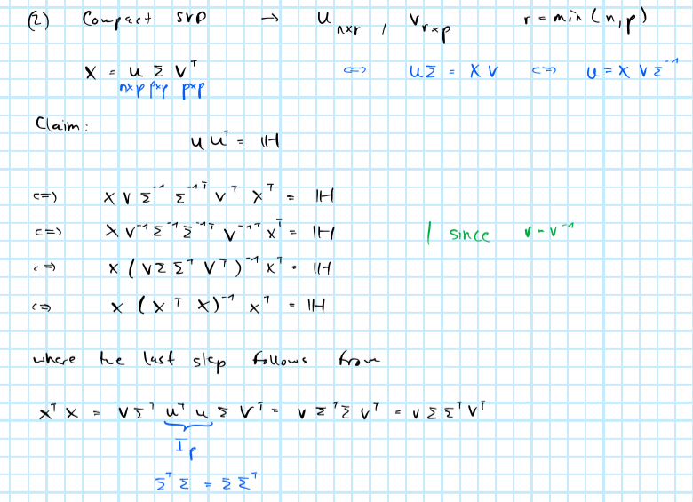
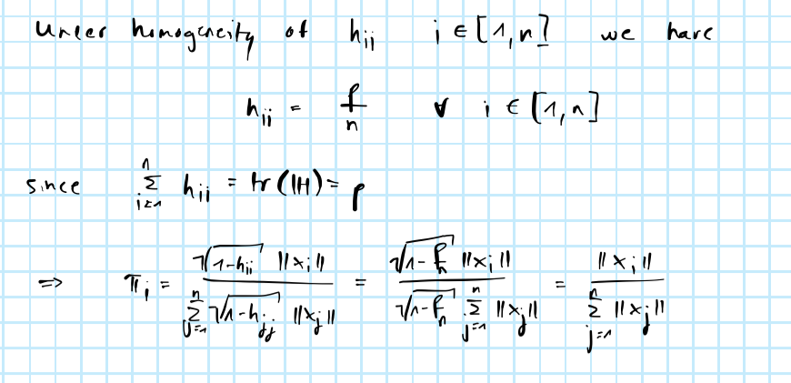

```{r setup, include=FALSE}
knitr::opts_chunk$set(echo = FALSE, message=FALSE, warning = FALSE)
library(fromScratchR)
```

# Optimal subsampling

When working with very large sample data, even the estimation of ordinary least-squares can be computationally prohibitive. Since we increasingly find ourselves in situations where the sample size $n$ is extremely high, a body of literature concerned with optimal subsampling has recently emerged. This post summarises some of the main ideas and methodologies that have emerged from that literature. The post is structured as follows: to set the stage for the remainder of the analysis the first section briefly introduces the bias-variance trade-off. The following section then introduces various subsampling methods. Finally, we will looks at a small empirical exercise that illustrates the improvements associated with non-uniform subsampling. 

## Bias-variance tradeoff

All computations are done in R. Code is reported only where it is deemed useful, but as always full details can be found in the [GitHub repository](https://github.com/pat-alt/patalt). In some places I use [fromScratchR](https://github.com/pat-alt/fromScratchR), a package I am working on. The package is very much a work-in-progress and at this point primarily serves the purpose of collecting any programs I code up from scratch. It can be installed from GitHub through `devtools::install_github("pat-alt/fromScratchR")`.

To set the stage for the remainder of this note we will briefly revisit the bias-variance trade-off in this section. In particular we will illustrate the effect of varying the sample size $n$. Readers familiar with this topic may choose to skip this section.

```{r}
# Generate data: ----
n <- 25
p <- 24
a <- 0
b <- 1
x <- seq(a,b,length.out = n)
y <- sinusoidal(x)
v <- 0.3
```

As as in @bishop2006pattern we consider synthetic data generated by the sinusoidal function $f(x)=\sin(2\pi x)$. To simulate random samples of $\mathbf{y}$ we sample $n$ input values from $\mathbf{X} \sim \text{unif}(0,1)$ and introduce a random noise component $\varepsilon \sim \mathcal{N}(0,`r v`)$. Figure \@ref(fig:p-sim) shows $\mathbf{y}$ along with random draws $\mathbf{y}^*_n$.

```{r p-sim, fig.cap="Sinusoidal function and random draws."}
# True data: ----
library(ggplot2)
library(data.table)
dt_true <- data.table(y,x)
pl <- ggplot(data=dt_true, aes(x=x, y=y)) +
  geom_line()
# Simulate data: ----
n_draws <- 3
dt_star <- rbindlist(
  lapply(
    1:n_draws,
    function(x) {
      simulated <- sim_sinusoidal(n=n, sigma = v)
      data.table(y=simulated$y_star, x=simulated$x_star, n=1:n, draw=x)
    }
  )
)
pl +
  geom_point(
    data = dt_star,
    aes(x=x, y=y, colour=factor(draw))
  ) +
  scale_colour_discrete(
    name="Draw:"
  )
```

```{r param-setup}
lambda <- c(
  exp(2.6),
  exp(-0.31),
  exp(-2.4)
)
s <- 0.1
n_draws <- 100
mu <- seq(a,b,length.out = p)
```

Following @bishop2006pattern we will use a Gaussian linear model with Gaussian kernels $\exp(-\frac{(x_k-\mu_p)^{2}}{2s^2})$ as 

$$
\begin{equation} 
\begin{aligned}
&& \mathbf{y}|\mathbf{X}& =f(x) \sim \mathcal{N} \left( \sum_{j=0}^{p-1} \phi_j(x)\beta_j, v \mathbb{I}_p \right) \\
\end{aligned}
(\#eq:model)
\end{equation}
$$

with $v=`r v`$ to estimate $\hat{\mathbf{y}}_k$ from random draws $\mathbf{X}_k$. We fix the number of kernels $p=`r p`$ (and hence the number of features $M=p+1=`r p+1`$) as well as the spatial scale $s=`r s`$. To vary the complexity of the model we use a form of regularized least-squares (*Ridge regression*) and let the regularization parameter $\lambda$ vary

$$
\begin{equation} 
\begin{aligned}
&& \hat\beta&=(\lambda I + \Phi^T \Phi)^{-1}\Phi^Ty \\
\end{aligned}
(\#eq:reg-ls)
\end{equation}
$$

where high values of $\lambda$ in \@ref(eq:reg-ls) shrink parameter values towards zero. (Note that a choice $\lambda=0$ corresponds to the OLS estimator which is defined as long as $p \le n$.)

As in @bishop2006pattern we proceed as follows for each choice of $\lambda$ and each sample draw to illustrate the bias-variance trade-off:

1. Draw $N=`r n`$ time from $\mathbf{u}_k \sim \text{unif}(`r a`,`r b`)$. 
2. Let $\mathbf{X}_k^*=\mathbf{u}_k+\varepsilon_k$ with $\varepsilon \sim \mathcal{N}(0, `r v`)$.
3. Compute $\mathbf{y}_k^*=\sin(2\pi \mathbf{X}^*_k)$.
4. Extract features $\Phi_k$ from $\mathbf{X}_k^*$ and estimate the parameter vector $\beta_k^*(\Phi_k,\mathbf{y}^*_k,\lambda)$ through regularized least-squares. 
5. Predict $\hat{\mathbf{y}}_k^*=\Phi \beta_k^*$.

```{r}
Phi <- cbind(
  rep(1,n),
  sapply(
    1:length(mu),
    function(p) {
      mu_p <- mu[p]
      gauss_kernel(x=x, mu=mu_p, s = s)
    }
  )
)
dt <- rbindlist(
  lapply( # loop - draw K times
    1:n_draws,
    function(k) {
      # Draw:
      simulated <- sim_sinusoidal(n=n, sigma = v)
      y_k <- simulated$y_star
      x_k <- simulated$x_star
      rbindlist(
        lapply( # loop over regularization parameter
          1:length(lambda),
          function(t) {
            # Regularization parameter:
            lambda_t <- lambda[t]
            # Extract features:
            Phi_k <- cbind(
              rep(1,n),
              sapply(
                1:length(mu),
                function(p) {
                  mu_p <- mu[p]
                  gauss_kernel(x=x_k, mu=mu_p, s = s)
                }
              )
            )
            beta_hat <- regularized_ls(Phi_k,y_k,lambda_t) # fit model on (y,x)
            y_hat <- c(Phi %*% beta_hat) # predict from model
            dt <- data.table(value=y_hat,draw=k,lambda=lambda_t,n=1:n,x=x)
            return(dt)
          }
        )
      )
    }
  )
)
dt[,facet_group:="single"]
dt[,colour_group:="estimates"]
# Expected values:
dt_exp = dt[,.(value=mean(value)),by=.(lambda,n,x)]
dt_exp[,facet_group:="aggregate"]
dt_exp[,colour_group:="estimates"]
dt_exp[,draw:=1] # just for aesthetics
# True values:
library(reshape)
dt_true = data.table(expand.grid.df(data.frame(value=y,x=x),data.frame(lambda=lambda)))
dt_true[,facet_group:="aggregate"]
dt_true[,colour_group:="true"]
dt_true[,draw:=2] # just for aesthetics
# Plot data:
dt_plot = rbind(
  dt,
  dt_exp,
  dt_true,
  fill=T
)
```

Applying the above procedure we can construct the familiar picture that demonstrates how increased model complexity increases variance while reducing bias (Figure \@ref(fig:plot-bias-var)). Recall that for the mean-squared error (MSE) we have 

$$
\begin{equation} 
\begin{aligned}
&& \mathbb{E} \left( (\hat{f}_n(x)-f(x))^2 \right)
&= \text{var} (\hat{f}_n(x)) + \left( \mathbb{E} \left( \hat{f}_n(x) \right) - f(x) \right)^2 \\
\end{aligned}
(\#eq:mse)
\end{equation}
$$

where the first term on the right-hand side corresponds to the variance of our prediction and the second term to its (squared) bias. In Figure \@ref(fig:plot-bias-var) as model complexity increases the variance component of the MSE increases, while the bias term diminishes. A similar pattern would have been observed if instead of using regularization we had used OLS and let the number of Gaussian kernels (and hence the number of features $p$) vary where higher values of $p$ correspond to increased model complexity.

```{r plot-bias-var, fig.cap="Bias-variance trade-off."}
dt_plot[,log_lambda := log(lambda)]
ggplot(data=dt_plot[draw<=25], aes(y=value, x=x, colour=colour_group, group=draw)) +
  geom_line() +
  facet_grid(
    rows = vars(log_lambda),
    cols = vars(facet_group)
  ) +
  scale_color_discrete(
    name="Type:"
  ) +
  labs(
    y = "f(x)"
  )
```

```{r sim-change-n}
n <- 100
m <- c(0.10, 0.5, 0.90)
x <- seq(a,b,length.out = n)
y <- sinusoidal(x)
lambda <- exp(-0.31)
Phi <- cbind(
  1,
  sapply(
    1:length(mu),
    function(p) {
      mu_p <- mu[p]
      gauss_kernel(x=x, mu=mu_p, s = s)
    }
  )
)
dt <- rbindlist(
  lapply( # loop - draw K times
    1:n_draws,
    function(k) {
      rbindlist(
        lapply( # loop over sample sizes:
          1:length(m),
          function(t) {
            n_sample <- m[t] * n
            # Draw:
            simulated <- sim_sinusoidal(n=n_sample, sigma = v)
            y_k <- simulated$y_star
            x_k <- simulated$x_star
            # Extract features:
            Phi_k <- cbind(
              1,
              sapply(
                1:length(mu),
                function(p) {
                  mu_p <- mu[p]
                  gauss_kernel(x=x_k, mu=mu_p, s = s)
                }
              )
            )
            beta_hat <- regularized_ls(Phi_k,y_k,lambda) # fit model on (y,x)
            y_hat <- c(Phi %*% beta_hat) # predict from model
            dt <- data.table(value=y_hat,draw=k,sample_size=n_sample,n=1:n,x=x)
            return(dt)
          }
        )
      )
    }
  )
)
dt[,facet_group:="single"]
dt[,colour_group:="estimates"]
# Expected values:
dt_exp = dt[,.(value=mean(value)),by=.(sample_size,n,x)]
dt_exp[,facet_group:="aggregate"]
dt_exp[,colour_group:="estimates"]
dt_exp[,draw:=1] # just for aesthetics
# True values:
library(reshape)
dt_true = data.table(expand.grid.df(data.frame(value=y,x=x),data.frame(sample_size=m*n)))
dt_true[,facet_group:="aggregate"]
dt_true[,colour_group:="true"]
dt_true[,draw:=2] # just for aesthetics
# Plot data:
dt_plot = rbind(
  dt,
  dt_exp,
  dt_true,
  fill=T
)
```

The focus of this note is instead on varying the sample size $n$. It should not be surprising that both the variance and bias component of the MSE decrease as the sample size $n$ increases (Figure \@ref(fig:plot-bias-var-n)). But in today's world $n$ can potentially be very large, so much so that even computing simple linear models can be hard. Suppose for example you wanted to use patient data that is generated in real-time as a global pandemic unfolds to predict the trajectory of said pandemic. Or consider the vast quantities of potentially useful user-generated data that online service providers have access to. In the remainder of this note we will investigate how systematic subsampling can help improve model accuracy in these situations.

```{r plot-bias-var-n, fig.cap="Bias-variance trade-off. The effect of sample size."}
ggplot(data=dt_plot[draw<=25], aes(y=value, x=x, colour=colour_group, group=draw)) +
  geom_line() +
  facet_grid(
    rows = vars(sample_size),
    cols = vars(facet_group)
  ) +
  scale_color_discrete(
    name="Type:"
  ) +
  labs(
    y = "f(x)"
  )
```

## Subsampling methods {#subsampling}

```{r}
n <- 1000
m <- 10
```

The case for subsampling generally involves $n >> p$, so very large values of $n$. In such cases we may be interested in estimating $\hat\beta_m$ instead of $\hat\beta_n$ where $p\le m<<n$ with $m$ freely chosen by us. In practice we may want to do this to avoid high computational costs associated with large $n$ as discussed above. The basic algorithm for estimating $\hat\beta_m$ is simple:

1. Subsample with replacement from the data with some sampling probability $\{\pi_i\}^n_{i=1}$.
2. Estimate least-squares estimator $\hat\beta_m$ using the subsample. 

But there are at least two questions about this algorithm: firstly, how do we choose $\mathbf{X}_m=({\mathbf{X}^{(1)}}^T,...,{\mathbf{X}^{(m)}}^T)^T$? Secondly, how should we construct $\hat\beta_m$? With respect to the former, a better idea than just randomly selecting $\mathbf{X}_m$ might be to choose observations with high influence. We will look at a few of the different subsampling methods investigated and proposed in @zhu2015optimal, which differ primarily in their choice of subsampling probabilities $\{\pi_i\}^n_{i=1}$:

1. Uniform subsampling (UNIF): $\{\pi_i\}^n_{i=1}=1/n$.
2. Basic leveraging (BLEV): $\{\pi_i\}^n_{i=1}=h_{ii}/ \text{tr}(\mathbf{H})=h_{ii}/p$ where $\mathbf{H}$ is the *hat matrix*.
3. Optimal (OPT) and predictor-length sampling (PL): involving $||\mathbf{X}_i||/ \sum_{j=1}^{n}||\mathbf{X}_j||$ where $||\mathbf{X}||$ denotes the $L_2$ norm of $\mathbf{X}$.

Methods involving predictor-lengths are proposed by the authors with the former shown to be optimal (more on this below). PL subsampling is shown to scale very well and a good approximation of optimal subsampling conditional on leverage scores $h_{ii}$ being fairly homogeneous.

With respect to the second question @zhu2015optimal investigate both ordinary least-squares (OLS) and weighted least-squares (WLS), where weights simply correspond to subsampling probabilities $\{\pi_i\}^n_{i=1}$. The authors present empirical evidence that OLS is more efficient than WLS in that the mean-squared error (MSE) for predicting $\mathbf{X} \beta$ is lower for OLS. The authors also note though that subsampling using OLS is not consistent for non-uniform subsampling methods meaning that the bias cannot be controlled. Given Equation \@ref(eq:mse) the fact that OLS is nonetheless more efficient than WLS implies that the higher variance terms associated with WLS dominates the effect of relatively higher bias with OLS. In fact this is consistent with the theoretical results presented in @zhu2015optimal (more on this below).

Next we will briefly run through different estimation and subsampling methods in some more detail and see how they can be implemented in R. In the following section we will then look at how the different approaches perform empirically.

### OLS and WLS

Both OLS and WLS are implemented here using QR decomposition. As for OLS this is very easily done in R. Given some feature matrix `X` and a corresponding outcome variable `y` we can use `qr.solve(X, y)` to compute $\hat\beta$. For WLS we need to first weigh observations by their corresponding subsampling probabilities. Following @zhu2015optimal we can construct a weighting matrix $\Phi= \text{diag}\{\pi_i\}^m_{i=1}$ and compute the weighted least-squares estimator as: (see [appendix](#app-wls) for derivation)

$$
\begin{equation} 
\begin{aligned}
&& \hat\beta_m^{WLS}&= \left( \mathbf{X}^T \Phi^{-1} \mathbf{X} \right)^{-1} \mathbf{X}^T\Phi^{-1}\mathbf{y}\\
\end{aligned}
(\#eq:wls)
\end{equation}
$$

In R weighted least-squares can be implemented (from scratch) as follows

```{r class.source = "fold-show", code=fromScratchR::wls_qr, echo=T, eval=F}
```

where in order to implement the algorithm propose in @zhu2015optimal the weights we need to supply as the function arguments are $w=\{1/\pi_i\}^m_{i=1}$. This follows from the following property of diagonal matrices:

$$
\begin{aligned}
&& \Phi^{-1}&= \begin{pmatrix}
1\over\phi_{11} & 0 & 0 \\
0 & ... & 0 \\
0 & 0 & 1\over \phi_{nn}
\end{pmatrix}
 \\
\end{aligned}
$$

### Uniform subsampling (UNIF)

A simple function for uniform subsampling in R is shown in the code chunk below. Note that to streamline the comparison of the different methods in the following section the function takes an unused argument `weighted=F` which for the other subsampling methods can be used to determine whether OLS or WLS should be used. Of course, with uniform subsampling the weights are all identical and hence $\hat\beta^{OLS}=\hat\beta^{WLS}$ so the argument is passed to but not evaluated in `sub_UNIF`.

```{r class.source = "fold-show", code=fromScratchR::UNIF.undersampler, echo=T, eval=FALSE}
```

### Basic leveraging (BLEV)

The `sub_UNIF` function can be extended easily to the case with basic leveraging (see code below). Note that in this case the `weighted` argument is actually evaluated. 

```{r class.source = "fold-show", code=fromScratchR::BLEV, echo=T, eval=FALSE}
```

#### A note on computing leverage scores

Recall that for the *hat matrix* we have

$$
\begin{equation} 
\begin{aligned}
&& \mathbf{H}&=\mathbf{X} (\mathbf{X}^T \mathbf{X})^{-1}\mathbf{X}^T \\
\end{aligned}
(\#eq:hat-mat)
\end{equation}
$$

where the diagonal elements $h_{ii}$ correspond to the leverage scores we're after. Following @zhu2015optimal we will use (compact) singular value decomposition to obtain $\mathbf{H}$ rather than computing \@ref(eq:hat-mat) directly. This has the benefit that there exist exceptionally stable numerical algorithms to compute SVD. To see how and why we can use SVD to obtain $\mathbf{H}$ see [appendix](#app-svd).

Clearly to get $h_{ii}$ we first need to compute $\mathbf{H}$ which in terms of computational costs is of order $\mathcal{O}(np^2)=\max(\mathcal{O}(np^2),\mathcal{O}(p^3))$. The fact that we use all $n$ rows of $\Phi$ to compute leverage scores even though we explicitly stated our goal was to only use $m$ observations may rightly seem like a bit of a paradox. This is why fast algorithms that approximate leverage scores have been proposed. We will not look at them specifically here mainly because the PL method proposed by @zhu2015optimal does not depend on leverage scores and promises to be computationally even more efficient.

### Predictor-length sampling (PL)

The basic characteristic of PL subsampling - choosing $\{\pi_i\}^n_{i=1}= ||\mathbf{X}_i||/ \sum_{j=1}^{n}||\mathbf{X}_j||$ - was already introduced above. Again it is very easy to modify the subsampling functions from above to this case:

```{r code=fromScratchR::PL, echo=T, eval=F}
```

#### A note on optimal subsampling (OPT)

In fact, PL subsampling is an approximate version of optimal subsampling (OPT). @zhu2015optimal show that asymptotically we have:

$$
\begin{equation} 
\begin{aligned}
&&\text{plim} \left( \text{var} (\hat{f}_n(x)) \right) > \text{plim} \left(\left( \mathbb{E} \left( \hat{f}_n(x) \right) - f(x) \right)^2 \right)  \\
\end{aligned}
(\#eq:plim)
\end{equation}
$$

Given this result minimizing the MSE (Equation \@ref(eq:mse)) with respect to subsampling probabilities $\{\pi_i\}^n_{i=1}$ corresponds to minimizing $\text{var} (\hat{f}_n(x))$. They further show that this minimization problem has the following closed-form solution:

$$
\begin{equation} 
\begin{aligned}
&& \pi_i&= \frac{\sqrt{(1-h_{ii})}||\mathbf{X}_i||}{\sum_{j=1}^n\sqrt{(1-h_{jj})}||\mathbf{X}_j||}\\
\end{aligned}
(\#eq:opt)
\end{equation}
$$

This still has computational costs of order $\mathcal{O}(np^2)$. But it should now be clear why PL subsampling is optimal conditional on leverage scores being homogeneous (see [appendix](#app-pl)). PL subsampling is associated with computational costs of order $\mathcal{O}(np)$, so a potentially massive improvement. The code for optimal subsampling is shown below:

```{r code=fromScratchR::OPT, echo=TRUE, eval=FALSE}
```

#### A note on computing predictor lengths

Computing the Euclidean norms $||\mathbf{X}_i||$ in R can be done explicitly by looping over the rows of $\mathbf{X}$ and computing the norm in each iteration. It turns out that this computationally very expensive. A much more efficient way of computing the vector of predictor lengths is as follows

$$
\begin{equation} 
\begin{aligned}
&& \mathbf{pl}&=\sqrt{\mathbf{X}^2 \mathbf{1}} \\
\end{aligned}
(\#eq:norm)
\end{equation}
$$

where $\mathbf{X}^2$ indicates *elements squared*, the square root is also taken *element-wise* and $\mathbf{1}$ is a $(p \times 1)$ vectors of ones. A performance benchmark of the two approaches is shown in Figure \@ref(fig:mbm-norm) below.

```{r mbm-norm, fig.cap="Benchmark of Euclidean norm computations."}
n <- 200
p <- 100
library(microbenchmark)
X <- matrix(rnorm(n*p),nrow=n)
check_for_equality <- function(values) {
  tol <- 1e-12
  error <- max(abs(values[[1]] - values[[2]]))
  error < tol
}
mb <- microbenchmark(
  "Loop" = {sapply(1:nrow(X), function(i) norm(as.matrix(X[i,]), type="f"))}, 
  "Matrix product" = {sqrt(X**2 %*% rep(1,ncol(X)))},
  check = check_for_equality
)
autoplot(mb)
```

### Comparison of methods

```{r}
n <- 1000
p <- 100
```

As discussed in @zhu2015optimal both OPT and PL subsampling tend to inflate subsampling probabilities of observations with low leverage scores and shrink those of high-leverage observations relative to BLEV. They show explicitly that this always holds for orthogonal design matrices. As a quick sense-check of the functions introduced above we can generate a random orthogonal design matrix $\mathbf{X}$ and plot subsampling probabilities with OPT and PL against those obtained with BLEV. Figure \@ref(fig:comp-methods) illustrates this relationship nicely. 

```{r comp-methods, fig.cap="Comparison of subsampling probabilities.", fig.height=3, fig.width=6}
X <- rorthogonal(n,p)
# Subsampling methods:
methods <- list(
  "UNIF" = UNIF,
  "BLEV" = BLEV,
  "OPT" = OPT,
  "PL" = PL
)
smpl_probs <- rbindlist(
  lapply(
    names(methods)[2:4],
    function(i) {
      method <- i
      prob <- methods[[method]](X, y=NULL, m=NULL, prob_only=T)
      return(data.table(prob=prob, method=method))
    }
  )
)
dt_plot <- rbindlist(
  lapply(
    names(methods)[3:4],
    function(i) {
      other_method <- i
      x <- smpl_probs[method=="BLEV"]$prob
      y <- smpl_probs[method==other_method]$prob
      data.table(x=x, y=y, y_var=other_method)
    }
  )
)
ggplot(dt_plot, aes(x=x, y=y)) +
  geom_abline(intercept = 0, slope=1, linetype="dashed") +
  geom_point(shape=1) +
  facet_grid(
    cols=vars(y_var)
  ) +
  labs(
    x="BLEV",
    y=""
  )
```

The design matrix $\mathbf{X}$ $(n \times p)$ with $n=`r n`$ and $p=`r p`$ was generated using SVD:

```{r class.source = "fold-show", code=fromScratchR::rorthogonal, echo=TRUE, eval=FALSE}
```

## Linear regression model {#lin-reg}

### A review of @zhu2015optimal

To illustrate the improvements associated with the methods proposed in @zhu2015optimal, we will briefly replicate their main empirical findings here. The evaluate the performance of the different methods we will proceed as follows:

**Empirical exercise**

1. Generate synthetic data $\mathbf{X}$ of dimension $(n \times m)$ with $n>>m$. 
2. Set some true model parameter $\beta=(\mathbf{1}^T_{\overline{m*0.6}},\mathbf{1}^T_{\underline{m*0.4}})^T$.
3. Model the outcome variable as $\mathbf{y}=\mathbf{X}\beta+\epsilon$ where $\epsilon \sim \mathcal{N}(\mathbf{0},\sigma^2 \mathbf{I}_n)$ and $\sigma=10$.
4. Estimate the full-sample OLS estimator $\hat\beta_n$ (a benchmark estimator of sorts in this setting).
5. Use one of the subsampling methods to estimate iteratively $\{\hat\beta^{(b)}_m\}^B_{b=1}$. Note that all subsampling methods are stochastic so $\hat\beta_m$ varies across iterations.
6. Evaluate average model performance of $\hat\beta_m$ under the mean-squared error criterium: $MSE= \frac{1}{B} \sum_{b=1}^{B} MSE^{(b)}$ where $MSE^{(b)}$ corresponds to the in-sample estimator of the mean-squared error of the $b$-th iteration.

```{r, include=F}
n <- 1000
p <- 3
```

As in @zhu2015optimal we will generate the design matrix $\mathbf{X}$ from 5 different distributions: 1) Gaussian (GA) with $\mathcal{N}(\mathbf{0},\Sigma)$; 2) Mixed-Gaussian (MG) with $0.5\mathcal{N}(\mathbf{0},\Sigma)+0.5\mathcal{N}(\mathbf{0},25\Sigma)$; 3) Log-Gaussian (LN) with $\log\mathcal{N}(\mathbf{0},\Sigma)$; 4) T-distribution with 1 degree of freedom (T1) and $\Sigma$; 5) T-distribution as in 4) but truncated at $[-p,p]$. All parameters are chosen in the same way as in @zhu2015optimal with exception of $n=`r n`$ and $p=`r p`$, which are significantly smaller choices in order to decrease the computational costs. The corresponding densities of the 5 data sets are shown in Figure \@ref(fig:dens) in the [appendix](#app-dens). 

```{r zhu-data, echo=TRUE}
set.seed(1)
library(expm)
matrix_grid <- expand.grid(i=1:p,j=1:p)
Sigma <- matrix(rep(0,p^2),p,p)
for (x in 1:nrow(matrix_grid)) {
  i <- matrix_grid$i[x]
  j <- matrix_grid$j[x]
  Sigma[i,j] <- 2 * (0.8)^(abs(i-j))
}
# 1.) Design matrix (as in Zhu et al): ----
GA <- matrix(rnorm(n*p), nrow = n, ncol = p) %*% sqrtm(t(Sigma))
# Gaussian mixture:
gaus_mix <- list(
  gaus_1 = matrix(rnorm(n*p), nrow = n, ncol = p) %*% sqrtm(t(Sigma)),
  gaus_2 = matrix(rnorm(n*p), nrow = n, ncol = p) %*% sqrtm((25 * t(Sigma)))
)
MG <- matrix(rep(0,n*p),n,p)
for (i in 1:nrow(MG)) {
  x <- sample(1:2,1)
  MG[i,] <- gaus_mix[[x]][i,]
}
# Log-Gaussian:
LN <- exp(GA)
# T-distribution:
T1 <- matrix(rt(n*p,1), nrow = n, ncol = p) %*% sqrtm(t(Sigma))
# Truncated T:
TT <- T1
TT[TT>p] <- p
TT[TT<(-p)] <- -p
data_sets <- list(
  GA = list(X = GA),
  MG = list(X = MG),
  LN = list(X = LN),
  TT = list(X = TT),
  T1 = list(X = T1)
)
# 2.) Outcome:
data_sets <- lapply(
  data_sets,
  function(i) {
    X <- i[["X"]]
    beta <- c(rep(1,ceiling(0.6*p)),rep(0.1,floor(0.4*p)))
    eps <- rnorm(n=n,mean=0,sd=10)
    y <- X %*% beta + eps
    list(X=X, y=y)
  }
)
```

We will run the empirical exercise for each data set and each subsampling method introduced above. Figure \@ref(fig:plot-smpl-prob) shows logarithms of the sampling probabilities corresponding to the different subsampling methods (UNIF not shown for obvious reasons). The plots look very similar to the one in @zhu2015optimal and is shown here primarily to reassure ourselves that we have implemented their ideas correctly. One interesting observation is worth pointing out however: note how the distributions for OPT and PL have lower standard deviations compared to BLEV. This should not be altogether surprising since we already saw above that for orthogonal design matrices the former methods inflate small leverage scores while shrinking high scores. But it is interesting to see that the same appears to hold for design matrices that are explicitly not orthogonal given our choice of $\Sigma$.

```{r plot-smpl-prob, fig.height=3.5, fig.width=10, fig.cap="Sampling probabilities for different subsampling methods."}
smpl_probs <- readRDS("../data/smpl_probs.rds")
ggplot(
  data = smpl_probs,
  aes(x=data, y=log(prob)) 
) +
  geom_hline(aes(yintercept=log(1/n)), linetype="dashed") +
  geom_boxplot() +
  facet_grid(
    col=vars(method)
  )
```

```{r}
# Simulation parameters:
m <- c()
counter <- 1
while(length(m)<7 & max(m/n)<.1) {
  temp <- max(p,(2^(counter)*1e-3) * n)
  m <- unique(c(m, temp))
  counter <- counter + 1
}
weighted <- c(T,F)
pgrid <- data.table(
  expand.grid(
    m=m, 
    method=names(methods), 
    weighted=weighted, 
    data_set=names(data_sets)
  )
)
```

```{r,eval=F}
set.seed(1)
grid_search <- rbindlist(
  lapply(
    1:nrow(pgrid),
    function(i) {
      m <- pgrid[i,m]
      estimator_name <- pgrid[i,method] 
      estimator <- methods[[estimator_name]]
      weighted <- pgrid[i, weighted]
      data_set <- pgrid$data[i]
      X <- data_sets[[data_set]]$X
      y <- data_sets[[data_set]]$y
      output <- sim_subsampling(X, y, m, estimator, weighted=weighted)
      output[,m:=m]
      output[,method:=estimator_name]
      output[,weighted:=weighted]
      output[,data_set:=data_set]
    }
  )
)
grid_search[,weighted:=factor(weighted)]
levels(grid_search$weighted) <- c("OLS","WLS")
grid_search[,log_value:=log(value)]
```

```{r}
grid_search <- readRDS("../data/grid_search_zhu.rds")
p_list <- lapply(
  1:2,
  function(i) {
    ggplot(
      data=grid_search[weighted==levels(weighted)[i]], 
      aes(x=m/n, y=log_value, colour=method)
    ) +
      geom_line() +
      geom_point() +
      facet_grid(
        rows = vars(variables),
        cols = vars(data_set),
        scales = "free_y"
      ) +
      scale_color_discrete(
        name="Subsampling:"
      ) +
      labs(
        x="m/n",
        y="Logarithm",
        title=levels(grid_search$weighted)[i]
      ) 
  }
)
names(p_list) <- levels(grid_search$weighted)
```

Figures \@ref(fig:wls-zhu) and \@ref(fig:ols-zhu) show the resulting MSE, squared bias and variance for the different subsampling methods and data sets using weighed least-squares and ordinary least-squares, respectively. The subsampling size increases along the horizontal axis. The figures are interactive to allow readers to zoom in etc.

For the data sets that are also shown in @zhu2015optimal we find the same overall pattern: PL and OPT outperform other methods when using weighted least-squares, while BLEV outperforms other methods when using unweighted/ordinary least-squares. 

For Gaussian data (GA) the differences between the methods are minimal since data points are homogeneous. A similar picture emerges when running the method comparison for the sinusoidal data introduced above (see [appendix](#app-sin)). In fact, @zhu2015optimal recommend to just rely on uniform subsampling when data is Gaussian. Another interesting observation is that for t-distributed data (T1) the non-uniform subsampling methods significantly outperform uniform subsampling methods. This is despite the fact that in the case of T1 data the conditions used to establish asymptotic consistency of the non-uniform subsampling methods in @zhu2015optimal are not fulfilled: in particular the fourth moment is not finite (in fact it is not defined). 

```{r wls-zhu, fig.height=5, fig.width=10, fig.cap="MSE, squared bias and variance for different subsampling methods and data sets. Subsampling with weighted least-squares."}
library(plotly)
# layout_ggplotly <- function(gg, x = -0.075, y = -0.025, x_legend=1.05, y_legend=0.95, mar= list(l=50,r=150,b=50)){
#   # The 1 and 2 goes into the list that contains the options for the x and y axis labels respectively
#   gg[['x']][['layout']][['annotations']][[1]][['y']] <- x
#   gg[['x']][['layout']][['annotations']][[2]][['x']] <- y
#   gg[['x']][['layout']][['annotations']][[11]][['x']] <- x_legend
#   gg[['x']][['layout']][['legend']][['y']] <- y_legend
#   gg[['x']][['layout']][['legend']][['x']] <- x_legend
#   gg %>% layout(margin = mar)
# }
gg <- ggplotly(p_list$WLS)
# layout_ggplotly(gg)
```

```{r ols-zhu, fig.height=5, fig.width=10, fig.cap="MSE, squared bias and variance for different subsampling methods and data sets. Subsampling with ordinary least-squares."}
gg <- ggplotly(p_list$OLS)
# layout_ggplotly(gg)
```

### Computational performance

```{r}
n <- 200
p <- 100
```

We have already seen above that theoretically speaking both BLEV and OPT subsampling are computationally more expensive than PL subsampling (with UNIF subsampling the least expensive). It should be obvious that in light of their computational costs $\mathcal{O}(np^2)$ the former two methods do not scale well in higher-dimensional problems (higher $p$). @zhu2015optimal demonstrate this through empirical exercises to an extent that is beyond the scope of this note. Instead we will just quickly benchmark the different functions for non-uniform subsampling introduced above: `sub_BLEV`, `sub_OPT`, `sub_PL` for $n=`r n`$, $p=`r p`$. We are only interested in how long it takes to compute subsampling probabilities, and since for `sub_UNIF` all subsampling probabilities are simply $\pi_i=1/n$ we neglect this here. Figure \@ref(fig:mbm-methods) benchmarks the three non-uniform subsampling methods. Evidently PL subsampling is computationally much less costly.

```{r mbm-methods, fig.cap="Benchmark of computational performance of different methods."}
library(microbenchmark)
X <- matrix(rnorm(n*p),nrow=n)
y <- rnorm(n)
mb <- microbenchmark(
  "BLEV" = {BLEV(X,y,prob_only = T)}, 
  "OPT" = {OPT(X,y,prob_only = T)},
  "PL" = {PL(X,y,prob_only = T)}
)
autoplot(mb)
```

## Further work

We have looked at subsampling of linear regression problems, but of course the story does not end here. For binary classification problems, for example, we cannot directly apply the methods used here, but the same general ideas still apply. @wang2018optimal explore optimal subsampling for large sample logistic regression - a paper that is very much related to @zhu2015optimal. For a brief summary and a (cautious) application to imbalanced learning see [here](https://pat-alt.github.io/fromScratch/optimal-subsampling.html#classification-problems). 

Very recently an [article](https://www.sciencedirect.com/science/article/pii/S0885064X20300558) has been published that investigates optimal subsampling in the context of quantile regression. More interesting work in this certain to emerge from this field, which researches some of the most pressing questions in large sample statistics.

## References

::: {#refs}
:::

## Appendix

### Weighted least-squares {- #app-wls}


### From SVD to leverage scores {- #app-svd}



### From optimal to prediction-length subsampling {- #app-pl}



### Synthetic data {- #app-dens}

```{r dens, fig.cap="Densities of synthetic design matrices."}
data_density <- rbindlist(
  lapply(
    1:length(data_sets),
    function(i) {
      x <- c(data_sets[[i]]$X)
      x_bar <- mean(c(data_sets[[i]]$X))
      sigma <- sd(c(data_sets[[i]]$X))
      x_std <- (x - x_bar) / sigma
      data.table(value = x_std, data_set=names(data_sets)[i])
    }
  )
)
ggplot(data_density, aes(value)) +
  geom_density() +
  facet_wrap(
    ~ data_set, 
    scales = "free"
  ) +
  labs(
    x="x (standardized)",
    y="Density"
  )
```

### Subsampling applied to sinusoidal function {- #app-sin}

```{r, eval=F}
# Function parameters:
n <- 1000
p <- 9
a <- 0
b <- 1
x <- seq(a,b,length.out = n)
y_true <- sinusoidal(x)
y <- sim_sinusoidal(n)$y
v <- 0.3
mu <- seq(a,b,length.out = p)
Phi <- cbind(
  rep(1,n),
  sapply(
    1:length(mu),
    function(p) {
      mu_p <- mu[p]
      gauss_kernel(x=x, mu=mu_p, s = s)
    }
  )
)
# Simulation parameters:
m <- c()
counter <- 1
while(length(m)<7 & max(m/n)<.1) {
  temp <- max(p+1,(2^(counter)*1e-3) * n)
  m <- unique(c(m, temp))
  counter <- counter + 1
}
weighted <- c(T,F)
param_grid <- data.table(expand.grid(m=m, method=names(methods), weighted=weighted))
```

```{r, eval=F}
set.seed(1)
grid_search <- rbindlist(
  lapply(
    1:nrow(param_grid),
    function(i) {
      m <- param_grid[i,m]
      estimator_name <- as.character(param_grid[i,method])
      estimator <- methods[[estimator_name]]
      weighted <- param_grid[i, weighted]
      output <- sim_subsampling(Phi, y, m, estimator, weighted=weighted)
      output[,m:=m]
      output[,method:=estimator_name]
      output[,weighted:=weighted]
    }
  )
)
grid_search[,weighted:=factor(weighted)]
levels(grid_search$weighted) <- c("OLS","WLS")
grid_search[,log_value:=log(value)]
grid_search[,method := factor(method, levels=c("UNIF", "BLEV", "OPT", "PL"))]
```

```{r}
grid_search <- readRDS("../data/grid_search_sinus.rds")
ggplot(
  data=grid_search, 
  aes(x=m/n, y=log_value, colour=method)
) +
  geom_line() +
  geom_point() +
  facet_grid(
    rows=vars(variables),
    cols = vars(weighted)
  ) +
  scale_color_discrete(
    name="Subsampling method:"
  ) +
  labs(
    x="m/n",
    y="Logarithm"
  ) 
```
