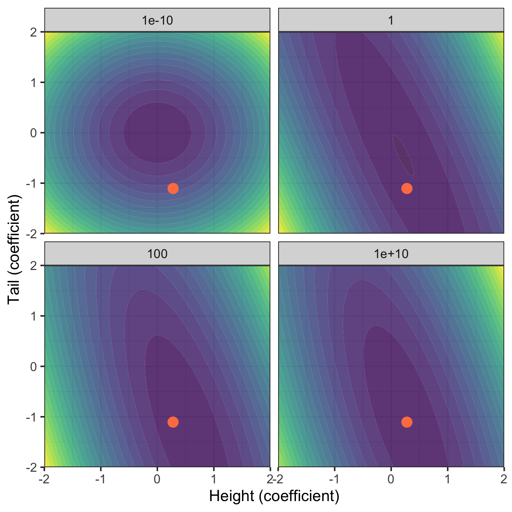
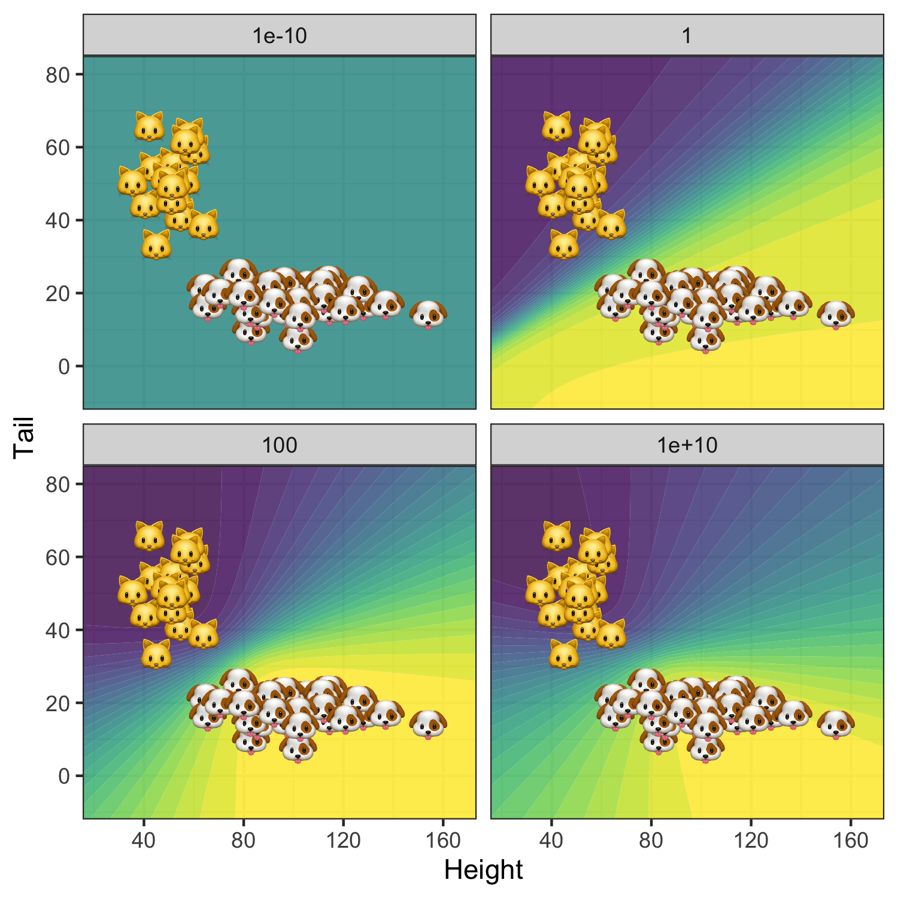

```{r setup, include=FALSE}
rm(list=ls())
knitr::opts_chunk$set(
  echo = FALSE, 
  message = FALSE, 
  fig.align='center'
)
library(data.table)
library(ggplot2)
library(gganimate)
library(ggimage)
seed <- 2021
theme_set(theme_bw())

# Get helper functions:
utils <- list.files("../utils/")
invisible(
  lapply(
    utils,
    function(i) {
      source(file = file.path("../utils",i))
    }
  )
)
```

## The ground truth

```{r}
w <- as.matrix(c(0,0.5,-1))
seed <- 42
set.seed(seed)
```

In this post we will work with a synthetic data set $\mathcal{D}$ composed of $N$ binary labels $y_n\in\{0,1\}$ and corresponding feature vectors $\mathbf{x}_n\in \mathbb{R}^D$. Working with synthetic data has the benefit that we have control over the **ground truth** that generates our data. In particular, we will assume that the binary labels $y_n$ are generated by a logistic regression model

$$
\begin{equation} 
\begin{aligned}
&& p(y_n|\mathbf{x}_n;\mathbf{w})&\sim\text{Ber}(y_n|\sigma(\mathbf{w}^T\mathbf{x}_n)) \\
\end{aligned}
(\#eq:logreg)
\end{equation}
$$

where $\sigma(a)=1/(1+e^{-a})$ is the **sigmoid** or **logit** function [@murphy2022probabilistic]. We let $\mathbf{w}=`r matrix2latex(w)`$ define the true coefficients. 

```{r}
logit <- function(w,X) {
  if (dim(X)[2]!=dim(w)[1]) {
    X <- cbind(1,as.matrix(X)) # add 1 for constant/bias
  } else {
    X <- as.matrix(X)
  }
  logit <- 1 / (1 + exp(-1 * (X %*% w)))
  return(logit)
}
```

```{r gauss-mix}
gauss_mix <- function(n, mu, sigma, weights) {
  u <- runif(n) # to determine which distribution to sample from
  d <- ncol(mu) # how many variables
  X <- t(
    sapply(
      u,
      function(u) {
        idx_dist <- which(cumsum(weights) > u)[1]
        X <- sapply(
          1:d, 
          function(i) {
            rnorm(1,mu[idx_dist,i],sigma[idx_dist,i])
          }
        )
        matrix(X,ncol=d)
      }
    )
  )
  return(X)
}
```


```{r mixture}
# Parameters
n <- 50
weights <- c(0.5,0.5)
mu <- rbind(c(50,50),c(100,20))
noise <- 0.2
sigma <- noise * mu
# Generate mixture:
X <- gauss_mix(n,mu,sigma,weights)
```

```{r}
# True Bernoulli probabilities based on synthetic features and true coefficients:
p <- logit(w,X)
# True labels based on synthetic features and true coefficients:
y <- rbinom(n,1,p)
dt <- data.table(y,X)
fwrite(dt, "data/cats_dogs.csv")
```

```{r, fig.width=5, fig.height=5}
dt_plot <- copy(dt) 
dt_plot[,emoji:=ifelse(y==1, "www/cat.png", "www/dog.png")]
ggplot(data=dt_plot, aes(x=V1,y=V2,image=emoji)) +
  geom_image(size=0.05) +
  labs(
    x="Tail length",
    y="Height"
  )
```

## The maths

Using the synthetic data $\mathcal{D}$ we will now estimate the logistic regression model \@ref(eq:logreg) that generates them. Estimation usually boils down to finding the vector of parameters $\hat{\mathbf{w}}$ that maximizes the likelihood of observing $\mathcal{D}$ under the assumed model. That estimate can then be used to compute predictions for some new unlabelled data set $\mathcal{D}=\{x_m:m=1,...,M\}$. We are then typically interested in how accurate these model predictions are. This sums up how many automated decision-making systems operate in practice these days: for example, a company that is interested speeding up its recruitment process could train a binary classifier on historical data to automatically assign labels ($\hat{y}_m \in \{\text{short-listed, rejected}\}$) to new applications $\mathbf{x}_m$. Does this seem like a sound approach to automated decision-making? Haven't we forgot anything? While I have mentioned prediction **accuracy** above, there was no mentioning of assessing the classifier's **uncertainty** around its predictions. The predicted labels $y_m$ are merely point estimates based on the learned model parameters, which are random variables! Focusing merely on prediction accuracy and ignoring uncertainty altogether installs a false confidence in automated decision-making systems. Any **trustworthy** approach to learning from data should at the very least be transparent about its own uncertainty. 

How then, can we estimate uncertainty around model parameters and predictions? Frequentist methods for uncertainty quantification generally involve either closed-form solutions based on asymptotic theory or bootstrapping (see for example [here](https://web.stanford.edu/class/archive/stats/stats200/stats200.1172/Lecture26.pdf) for the case of logistic regression). In Bayesian statistics and machine learning we instead use the **posterior distribution** over model parameters to quantify uncertainty. This approach to uncertainty quantification is known as **Bayesian Inference** because we treat model parameters in a Bayesian way: we make assumptions about their distribution based on **prior** knowledge or beliefs and update these beliefs in light of new evidence. The frequentist approach avoids the need for being explicit about prior beliefs, which in the past has sometimes been considered as *un*scientific. However, frequentist methods come with their own assumption and pitfalls (see for example @murphy2012machine) for a discussion). Without diving further into this argument, let us now see how Bayesian logistic regression can be implemented.

### Problem setup

The starting point for Bayesian Logistic Regression is **Bayes' Theorem**:

$$
\begin{equation} 
\begin{aligned}
&& p(\mathbf{w}|\mathcal{D})&\propto p(\mathcal{D}|\mathbf{w})p(\mathbf{w}) \\
\end{aligned}
(\#eq:posterior)
\end{equation}
$$
Formally, this says that the posterior distribution of parameters $\mathbf{w}$ is proportional to the product of the likelihood of observing $\mathcal{D}$ given $\mathbf{w}$ and the prior density of $\mathbf{w}$. Applied to our context this can intuitively be understood as follows: our posterior beliefs around $\mathbf{w}$ are formed by both our prior beliefs and the evidence we observe. Yet another way to this is that maximising \@ref(eq:posterior) with respect to $\mathbf{w}$ corresponds to maximum likelihood estimation regularized by prior beliefs. 

Under the assumption that individual label-feature pairs are **independently** and **identically** distributed, their joint likelihood is simply the product over their individual densities. The prior beliefs around $\mathbf{w}$ are at our discretion. In practice they may be derived from previous experiments. Here we will use a zero-mean spherical Gaussian prior for reasons explained further below. To sum this up we have

$$
\begin{equation} 
\begin{aligned}
&& p(\mathcal{D}|\mathbf{w})& \sim \prod_{n=1}^N p(y_n|\mathbf{x}_n;\mathbf{w})\\
&& p(\mathbf{w})& \sim \mathcal{N} \left( \mathbf{w} | \mathbf{w}_0, \Sigma_0 \right) \\
\end{aligned}
(\#eq:prior)
\end{equation}
$$

with $\mathbf{w}_0=\mathbf{0}$ and $\Sigma_0=\sigma^2\mathbf{I}$. Plugging this into Bayes' rule we finally have

$$
\begin{aligned}
&& p(\mathbf{w}|\mathcal{D})&\propto\prod_{n=1}^N \text{Ber}(y_n|\sigma(\mathbf{w}^T\mathbf{x}_n))\mathcal{N} \left( \mathbf{w} | \mathbf{w}_0, \Sigma_0 \right) \\
\end{aligned}
$$


Unlike with linear regression there are no closed-form analytical solutions to estimating or maximising this posterior, but fortunately accurate approximations do exist [@murphy2022probabilistic]. One of the simplest approaches called **Laplace Approximation** is straight-forward to implement and not computationally expensive. It can be shown that under the assumption of a Gaussian prior, the posterior of logistic regression is also approximately Gaussian: in particular, it approximately follows a Gaussian distribution centered around the **maximum a posteriori** (MAP) estimate $\hat{\mathbf{w}}=\arg\max_{\mathbf{w}} p(\mathbf{w}|\mathcal{D})$ and with a covariance matrix equal to the inverse Hessian evaluated at the mode $\hat{\Sigma}=(\mathbf{H}(\hat{\mathbf{w}}))^{-1}$. With that in mind, finding $\hat{\mathbf{w}}$ seems like a natural next step.

### Solving the problem

In practice we do not maximize the likelihood $p(\mathbf{w}|\mathcal{D})$ directly. Instead we minimize the negative log likelihood, which is equivalent and easier to implement. In \@ref(eq:likeli) below I have denoted the negative log likelihood as $\ell(\mathbf{w})$ indicating that this is the **loss function** we aim to minimize. The following two lines in \@ref(eq:likeli) show the gradient and Hessian - so the first- and second-order derivatives of $\ell$ with respect to $\mathbf{w}$ - where $\mathbf{H}_0=\Sigma_0^{-1}$ and $\mu_n=\sigma(\mathbf{w}^T\mathbf{x}_n)$. To understand how exactly the gradient and Hessian are derived see for example chapter 10 in @murphy2022probabilistic.^[Note that the author works with the negative log likelihood scaled by the sample size]. 

$$
\begin{equation} 
\begin{aligned}
&& \ell(\mathbf{w})&=- \sum_{n=1}^{N} [y_n \log \mu_n + (1-y_n)\log (1-\mu_n)] + \frac{1}{2} (\mathbf{w}-\mathbf{w}_0)^T\mathbf{H}_0(\mathbf{w}-\mathbf{w}_0) \\
&& \nabla_{\mathbf{w}}\ell(\mathbf{w})&= \sum_{n=1}^{N} (\mu_n-y_n) \mathbf{x}_n + \mathbf{H}_0(\mathbf{w}-\mathbf{w}_0) \\
&& \nabla^2_{\mathbf{w}}\ell(\mathbf{w})&= \sum_{n=1}^{N} (\mu_n-y_n) \left( \mu_n(1-\mu_n) \mathbf{x}_n \mathbf{x}_n^T \right) + \mathbf{H}_0\\
\end{aligned}
(\#eq:likeli)
\end{equation}
$$

SIDENOTE 

Note how earlier I mentioned that maximising the posterior likelihood corresponds to a regularized version of MLE...

Since minimizing this loss function is a convex optimization problem we have many efficient algorithms to choose from in order to solve this problem. With the Hessian at hand it seems natural to use a second-order method, because incorporating information about the curvature of the loss function generally leads to faster convergence. Here we will implement Newton's method in line with the presentation in chapter 8 of @murphy2022probabilistic. 

### Posterior predictive

With the posterior distribution over parameters $p(\mathbf{w}|\mathcal{D})$ at hand we have the necessary ingredients to estimate the posterior predictive distribution $p(y=1|\mathbf{x}, \mathcal{D})$. This estimated distribution can then be used to quantify the uncertainty around our predictions. ...

## The code

We now have all the necessary ingredients to code Bayesian Logistic Regression up from scratch. While in practice we would usually want to rely on existing packages that have been properly tested, I often find it very educative and rewarding to program algorithms from the bottom up. You will see that Julia's syntax so closely resembles the mathematical formulas we have seen above, that going from maths to code is incredibly straight-forward. Seeing those formulas and algorithms then actually doing their magic is quite fun! The code chunk below, for example, shows the implementation of the loss function and its derivatives from \@ref(eq:likeli) above. Take a moment to go through the code line-by-line and try to understand what it does. Isn't it amazing how closely the code resembles the actual equations? 

```{julia, eval=FALSE, echo=T}
# Loss:
function 𝓁(w,w_0,H_0,X,y)
    N = length(y)
    D = size(X)[2]
    μ = sigmoid(w,X)
    Δw = w-w_0
    l = - ∑( y[n] * log(μ[n]) + (1-y[n]) * log(1-μ[n]) for n=1:N) + 1/2 * Δw'H_0*Δw
    return l
end

# Gradient:
function ∇𝓁(w,w_0,H_0,X,y)
    N = length(y)
    μ = sigmoid(w,X)
    Δw = w-w_0
    g = ∑((μ[n]-y[n]) * X[n,:] for n=1:N)
    return g + H_0*Δw
end
    
# Hessian:
function ∇∇𝓁(w,w_0,H_0,X,y)
    N = length(y)
    μ = sigmoid(w,X)
    H = ∑(μ[n] * (1-μ[n]) * X[n,:] * X[n,:]' for n=1:N)
    return H + H_0
end
```

Aside from the optimization routine this is essentially all there is to coding up Bayesian Logistic Regression from scratch in Julia Language. If you are curious to see the full source code in detail you can check out this [interactive notebook](https://colab.research.google.com/github/pat-alt/pat-alt.github.io/blob/logitbayes/content/post/2021-10-27-bayesian-logistic-regression/toy_example.ipynb). Now let us finally turn back to our synthetic data and see how Bayesian Logistic Regression can help us understand the uncertainty around our model predictions.

## The estimates

```{r}

```

```{r}

```

<!-- ### MCMC using `rstan` -->

<!-- Now let us see if wee can improve upon the Laplace Approximation by instead relying on Monte Carlo methods.  -->

<!-- ```{r, echo=FALSE} -->
<!-- library(rstan) -->
<!-- options(mc.cores = parallel::detectCores()) -->
<!-- rstan_options(auto_write = TRUE) -->
<!-- ``` -->

<!-- ```{r, message=FALSE, eval=FALSE} -->
<!-- sigma <- 10 # uncertainty around prior -->
<!-- n_iter <- 100 # default is 2000 -->
<!-- model_data <- list( -->
<!--   N = nrow(X), -->
<!--   K = ncol(X), -->
<!--   X = as.matrix(X), -->
<!--   y = y, -->
<!--   sigma = sigma -->
<!-- ) -->
<!-- fit <- stan( -->
<!--   file = 'logit.stan',  -->
<!--   data = model_data, -->
<!--   iter = n_iter, -->
<!--   seed = seed -->
<!-- ) -->
<!-- ``` -->

## References

For a great reference regarding the theory covered in this post see @murphy2022probabilistic (chapters 4 and 10) and @bishop2006pattern (chapter 8). The section on `rstan` draws heavily on a great [blog post](https://www.r-bloggers.com/2020/02/bayesian-logistic-regression-with-stan/) and also the [Stan User's Guide](https://mc-stan.org/docs/2_21/stan-users-guide/index.html#overview). 

<div id="refs"></div>


