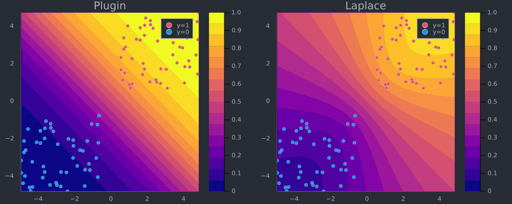
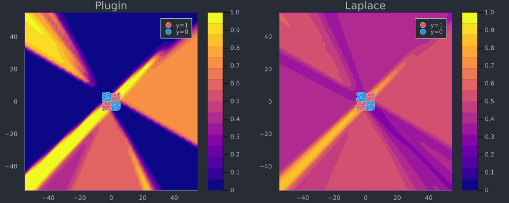

## Why Bayes?

Deep learning has dominated AI research in recent years[^1] - but how
much promise does it really hold? That is very much an ongoing and
increasingly polarising debate that you can follow live on
[Twitter](https://twitter.com/ilyasut/status/1491554478243258368). On
one side you have optimists like Ilya Sutskever, chief scientist of
OpenAI, who believes that large deep neural networks may already be
slighty conscious - that's "may" and "slightly" and only if you just go
deep enough? On the other side you have prominent sceptics like Judea
Pearl who has long since argued that deep learning still boils down to
curve fitting - purely associational and not even remotely intelligent
(Pearl and Mackenzie 2018).

Whatever side of this entertaining debate you find yourself on, the
reality is that deep-learning systems have already been deployed at
large scale both in academia and industry. More pressing debates
therefore revolve around the trustworthiness of these existing systems.
How robust are they and in what way exactly do they arrive at decisions
that affect each and every one of us? Robustifying deep neural networks
generally involves some form of adversarial training, which is costly,
can hurt generalization (Raghunathan et al. 2019) and does ultimately
not guarantee stability (Bastounis, Hansen, and Vlačić 2021). With
respect to interpretability, surrogate explainers like LIME and SHAP are
among the most popular tools, but they too have been shown to lack
robustness (Slack et al. 2020).

Exactly why are deep neural networks instable and intransparent? Let
𝒟 = {*x*, *y*}<sub>*n* = 1</sub><sup>*N*</sup> denote our feature-label
pairs and let *f*(*x*;*θ*) = *y* denote some deep neural network
specified by its parameters *θ*. Then the first thing to note is that
the number of free parameters *θ* is typically huge (if you ask Mr
Sutskever it really probably cannot be huge enough!). That alone makes
it very hard to monitor and interpret the inner workings of
deep-learning algorithms. Perhaps more importantly though, the number of
parameters *relative* to the size of 𝒟 is generally huge:

> \[...\] deep neural networks are typically very underspecified by the
> available data, and \[...\] parameters \[therefore\] correspond to a
> diverse variety of compelling explanations for the data. (Wilson 2020)

In other words, training a single deep neural network may (and usually
does) lead to one random parameter specification that fits the
underlying data very well. But in all likelihood there are many other
specifications that also fit the data very well. This is both a strength
and vulnerability of deep learning and very much calls for treating
predictions from deep learning models probabilistically (Wilson 2020).
Formally, we are interested in estimating the posterior predictive
distribution as the following Bayesian model average (BMA):

*p*(*y*\|*x*,𝒟) = ∫*p*(*y*\|*x*,*θ*)*p*(*θ*\|𝒟)*d**θ*

The integral implies that we essentially need many predictions from many
different specifications of *θ*. Unfortunately, this means more work for
us or rather our computers. Fortunately though, researchers have
proposed many ingenious ways to approximate the equation above: Gal and
Ghahramani (2016) propose using dropout at test time while
Lakshminarayanan, Pritzel, and Blundell (2016) show that averaging over
an ensemble of just five models seems to do the trick. Still, despite
their simplicity and usefulness these approaches involve additional
computational costs compared to training just a single network. As we
shall see now though, another promising approach has recently entered
the limelight: **Laplace approximation** (LA).

If you have read my [previous
post](https://towardsdatascience.com/bayesian-logistic-regression-53df017ba90f)
on Bayesian Logisitic Regression, then the term Laplace should already
sound familiar to you. As a matter of fact, we will see that all
concepts covered in that previous post can be naturally extended to deep
learning. While some of these concepts will be revisited below, I
strongly recommend you check out the previous post before reading on
here. Without further ado let us now see how LA can be used for truly
effortless deep learning.

## Laplace Approximation

While LA was first proposed in the 18th century, it has so far not
attracted serious attention from the deep learning community largely
because it involves a possibly large Hessian computation. Daxberger et
al. (2021) are on a mission to change the perception that LA has no use
in DL: in their [NeurIPS 2021
paper](https://arxiv.org/pdf/2106.14806.pdf) they demonstrate
empirically that LA can be used to produce Bayesian model averages that
are at least at par with existing approaches in terms of uncertainty
quantification and out-of-distribution detection. They show that recent
advancements in autodifferentation can be leveraged to produce fast and
accurate approximations of the Hessian and even provide a fully-fledged
[Python library](https://aleximmer.github.io/Laplace/) that can be used
with any pretrained Torch model. For this post, I have built a much less
comprehensive, pure-play equivalent of their package in Julia -
[BayesLaplace.jl](https://www.paltmeyer.com/BayesLaplace.jl/dev/) can be
used with deep learning models built in [Flux.jl](https://fluxml.ai/),
which is Julia's main DL library. As in the previous post on Bayesian
logistic regression I will rely on Julia code snippits instead of
equations to convey the underlying maths. If you're curious about the
maths, the [NeurIPS 2021 paper](https://arxiv.org/pdf/2106.14806.pdf)
provides all the detail you need.

### From Bayesian Logisitic Regression ...

Let's recap: in the case of logisitic regression we had a assumed a
zero-mean Gaussian prior
*p*(**w**) ∼ 𝒩(**w**\|**0**,*σ*<sub>0</sub><sup>2</sup>**I**) = 𝒩(**w**\|**0**,**H**<sub>0</sub><sup>−1</sup>)
for the weights that are used to compute logits
*μ*<sub>*n*</sub> = **w**<sup>*T*</sup>**x**<sub>*n*</sub>, which in
turn are fed to a sigmoid function to produce probabilities
*p*(*y*<sub>*n*</sub>=1) = *σ*(*μ*<sub>*n*</sub>). We saw that under
this assumption solving the logisitic regression problem corresponds to
minimizing the following differentiable loss function:

ℓ(**w**) =  − ∑<sub>*n*</sub>\[*y*<sub>*n*</sub>log*μ*<sub>*n*</sub>+(1−*y*<sub>*n*</sub>)log(1−*μ*<sub>*n*</sub>)\] + 0.5(**w**−**w**<sub>0</sub>)<sup>*T*</sup>**H**<sub>0</sub>(**w**−**w**<sub>0</sub>)

As our first step towards Bayesian deep learning, we observe the
following: the loss function above corresponds to the objective faced by
a single-layer artificial neural network with sigmoid activation and
weight decay[^2]. In other words, regularized logisitic regression is
equivalent to a very simple neural network architecture and hence it is
not surprising that underlying concepts can in theory be applied in much
the same way.

So let's quickly recap the next core concept: LA relies on the fact that
the second-order Taylor expansion of our loss function ℓ evaluated at
the **maximum a posteriori** (MAP) estimate
**ŵ** = arg max<sub>**w**</sub>*p*(**w**\|𝒟) amounts to a multi-variate
Gaussian distribution. In particular, that Gaussian is centered around
the MAP estimate with covariance equal to the inverse Hessian evaluated
at the mode *Σ̂* = (**H**(**ŵ**))<sup>−1</sup> (Murphy 2022).

That is basically all there is to the story: if we have a good estimate
of **H**(**ŵ**) we have an analytical expression for an (approximate)
posterior over parameters. So let's go ahead and start by run Bayesian
logisitic regression using [Flux.jl](https://fluxml.ai/). We begin by
loading some required packages including
[BayesLaplace.jl](https://www.paltmeyer.com/BayesLaplace.jl/dev/). It
ships with a helper function `toy_data_linear` that creates a toy data
set composed of linearly separable samples evenly balanced across the
two classes.

``` julia
# Import libraries.
using Flux, Plots, Random, PlotThemes, Statistics, BayesLaplace
theme(:juno)
# Number of points to generate.
xs, y = toy_data_linear(100)
X = hcat(xs...); # bring into tabular format
data = zip(xs,y);
```

Then we proceed to prepare the single-layer neural network with weight
decay. The term *λ* determines the strength of the ℓ2 penalty: we
regularize parameters *θ* more heavily for higher values. Equivalently,
we can say that from the Bayesian perspective it governs the strength of
the prior
*p*(*θ*) ∼ 𝒩(*θ*\|**0**,*σ*<sub>0</sub><sup>2</sup>**I**) = 𝒩(**w**\|**0**,*λ*<sub>0</sub><sup>−2</sup>**I**):
a higher value of *λ* indicates a higher conviction about our prior
belief that *θ* = **0**, which is of course equivalent to regularizing
more heavily. The exact choice of *λ* = 0.5 for this toy example is
somewhat arbitrary (it made for good visualizations below). Note that I
have used *θ* to denote our neural parameters to distinguish the case
from Bayesian logisitic regression, but we are in fact still solving the
same problem.

``` julia
nn = Chain(Dense(2,1))
λ = 0.5
sqnorm(x) = sum(abs2, x)
weight_regularization(λ=λ) = 1/2 * λ^2 * sum(sqnorm, Flux.params(nn))
loss(x, y) = Flux.Losses.logitbinarycrossentropy(nn(x), y) + weight_regularization();
```

Before we apply Laplace approximation we train our model:

``` julia
using Flux.Optimise: update!, ADAM
opt = ADAM()
epochs = 50

for epoch = 1:epochs
  for d in data
    gs = gradient(params(nn)) do
      l = loss(d...)
    end
    update!(opt, params(nn), gs)
  end
end
```

Up until this point we have just followed the standard recipe for
training a regularized artificial neural network in
[Flux.jl](https://fluxml.ai/) for a simple binary classification task.
To compute the Laplace approximation using
[BayesLaplace.jl](https://www.paltmeyer.com/BayesLaplace.jl/dev/) we
need just two more lines of code:

``` julia
la = laplace(nn, λ=λ)
fit!(la, data);
```

Under the hood the Hessian is approximated through the **empirical
Fisher**, which can be computed using only the gradients of our loss
function
∇<sub>*θ*</sub>ℓ(*f*(**x**<sub>*n*</sub>;*θ*,*y*<sub>*n*</sub>)) where
{**x**<sub>*n*</sub>, *y*<sub>*n*</sub>} are training data (see [NeurIPS
2021 paper](https://arxiv.org/pdf/2106.14806.pdf) for details). Finally,
[BayesLaplace.jl](https://www.paltmeyer.com/BayesLaplace.jl/dev/) ships
with a function
`predict(𝑳::LaplaceRedux, X::AbstractArray; link_approx=:probit)` that
computes the posterior predictive using a probit approximation, much
like we saw in the previous post. That function is used under the hood
of the `plot_contour` function below to create the right panel of
[Figure 1](#fig-logit). It visualizes the posterior predictive
distribution in the 2D feature space. For comparison I have added the
corresponding plugin estimate as well. Note how for the Laplace
approximation the predicticted probabilities fan out indicating that
confidence decrease in regions scarce of data.

``` julia
p_plugin = plot_contour(X',y,la;title="Plugin",type=:plugin);
p_laplace = plot_contour(X',y,la;title="Laplace")
# Plot the posterior distribution with a contour plot.
plt = plot(p_plugin, p_laplace, layout=(1,2), size=(1000,400))
savefig(plt, "www/posterior_predictive_logit.png");
```

<figure>
<figcaption aria-hidden="true">Figure 1: Posterior predictive distribution of logisitic regression in the 2D feature space using plugin estimator (left) and Laplace approximation (right).</figcaption>
</figure>

### ... to Bayesian Neural Networks

Now let's step it up a notch: we will repeat the exercise from above,
but this time for data that is not linearly separable using a simple MLP
instead of the single-layer neural network we used above. The code below
is almost the same as above, so I will not go through the various steps
again.

``` julia
# Number of points to generate:
xs, y = toy_data_non_linear(200)
X = hcat(xs...); # bring into tabular format
data = zip(xs,y)

# Build MLP:
n_hidden = 32
D = size(X)[1]
nn = Chain(
    Dense(D, n_hidden, σ),
    Dense(n_hidden, 1)
)  
λ = 0.01
sqnorm(x) = sum(abs2, x)
weight_regularization(λ=λ) = 1/2 * λ^2 * sum(sqnorm, Flux.params(nn))
loss(x, y) = Flux.Losses.logitbinarycrossentropy(nn(x), y) + weight_regularization()

# Training:
epochs = 200
for epoch = 1:epochs
  for d in data
    gs = gradient(params(nn)) do
      l = loss(d...)
    end
    update!(opt, params(nn), gs)
  end
end
```

Fitting the Laplace approximation is also analogous, but note that this
we have added an argument: `subset_of_weights=:last_layer`. This
specifies that we only want to use the parameters of the last layer of
our MLP. While we could have used all of them
(`subset_of_weights=:all`), Daxberger et al. (2021) find that the
last-layer Laplace approximation produces satisfying results, while be
computationally cheaper. [Figure 2](#fig-mlp) demonstrates that once
again the Laplace approximation yields a posterior predictive
distribution that is more conservative than the over-confident plugin
estimate.

``` julia
la = laplace(nn, λ=λ, subset_of_weights=:last_layer)
fit!(la, data);
p_plugin = plot_contour(X',y,la;title="Plugin",type=:plugin)
p_laplace = plot_contour(X',y,la;title="Laplace")
# Plot the posterior distribution with a contour plot.
plt = plot(p_plugin, p_laplace, layout=(1,2), size=(1000,400))
savefig(plt, "www/posterior_predictive_mlp.png");
```

<figure>
<figcaption aria-hidden="true">Figure 2: Posterior predictive distribution of MLP in the 2D feature space using plugin estimator (left) and Laplace approximation (right).</figcaption>
</figure>

To see why this is a desirable outcome consider the zoomed out version
of [Figure 2](#fig-mlp) below: the plugin estimator classifies with full
confidence in regions completely scarce of any data. Arguably Laplace
approximation produces a much more reasonable picture, even though it
too could likely be improved by fine-tuning our choice of *λ* and the
neural network architecture.

``` julia
zoom=-50
p_plugin = plot_contour(X',y,la;title="Plugin",type=:plugin,zoom=zoom);
p_laplace = plot_contour(X',y,la;title="Laplace",zoom=zoom);
# Plot the posterior distribution with a contour plot.
plt = plot(p_plugin, p_laplace, layout=(1,2), size=(1000,400));
savefig(plt, "www/posterior_predictive_mlp_zoom.png");
```

<figure>
<figcaption aria-hidden="true">Figure 3: Posterior predictive distribution of MLP in the 2D feature space using plugin estimator (left) and Laplace approximation (right). Zoomed out.</figcaption>
</figure>

## Wrapping up

The case for Bayesian Deep Learning is strong: ...

## References

<div id="refs" class="references csl-bib-body hanging-indent">

<div id="ref-bastounis2021mathematics" class="csl-entry">

Bastounis, Alexander, Anders C Hansen, and Verner Vlačić. 2021. "The
Mathematics of Adversarial Attacks in AI--Why Deep Learning Is Unstable
Despite the Existence of Stable Neural Networks." *arXiv Preprint
arXiv:2109.06098*.

</div>

<div id="ref-daxberger2021laplace" class="csl-entry">

Daxberger, Erik, Agustinus Kristiadi, Alexander Immer, Runa Eschenhagen,
Matthias Bauer, and Philipp Hennig. 2021. "Laplace Redux-Effortless
Bayesian Deep Learning." *Advances in Neural Information Processing
Systems* 34.

</div>

<div id="ref-gal2016dropout" class="csl-entry">

Gal, Yarin, and Zoubin Ghahramani. 2016. "Dropout as a Bayesian
Approximation: Representing Model Uncertainty in Deep Learning." In
*International Conference on Machine Learning*, 1050--59. PMLR.

</div>

<div id="ref-lakshminarayanan2016simple" class="csl-entry">

Lakshminarayanan, Balaji, Alexander Pritzel, and Charles Blundell. 2016.
"Simple and Scalable Predictive Uncertainty Estimation Using Deep
Ensembles." *arXiv Preprint arXiv:1612.01474*.

</div>

<div id="ref-murphy2022probabilistic" class="csl-entry">

Murphy, Kevin P. 2022. *Probabilistic Machine Learning: An
Introduction*. MIT Press.

</div>

<div id="ref-pearl2018book" class="csl-entry">

Pearl, Judea, and Dana Mackenzie. 2018. *The Book of Why: The New
Science of Cause and Effect*. Basic books.

</div>

<div id="ref-raghunathan2019adversarial" class="csl-entry">

Raghunathan, Aditi, Sang Michael Xie, Fanny Yang, John C Duchi, and
Percy Liang. 2019. "Adversarial Training Can Hurt Generalization."
*arXiv Preprint arXiv:1906.06032*.

</div>

<div id="ref-slack2020fooling" class="csl-entry">

Slack, Dylan, Sophie Hilgard, Emily Jia, Sameer Singh, and Himabindu
Lakkaraju. 2020. "Fooling Lime and Shap: Adversarial Attacks on Post Hoc
Explanation Methods." In *Proceedings of the AAAI/ACM Conference on AI,
Ethics, and Society*, 180--86.

</div>

<div id="ref-wilson2020case" class="csl-entry">

Wilson, Andrew Gordon. 2020. "The Case for Bayesian Deep Learning."
*arXiv Preprint arXiv:2001.10995*.

</div>

</div>

[^1]: See for example [this
    article](https://www.technologyreview.com/2019/01/25/1436/we-analyzed-16625-papers-to-figure-out-where-ai-is-headed-next/)
    in the MIT Technology Review

[^2]: See this [answer](https://stats.stackexchange.com/a/500973/288736)
    on Stack Exchange for a detailed discussion.
