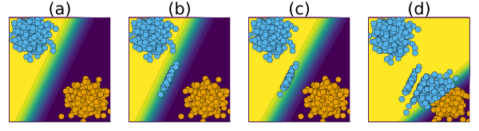
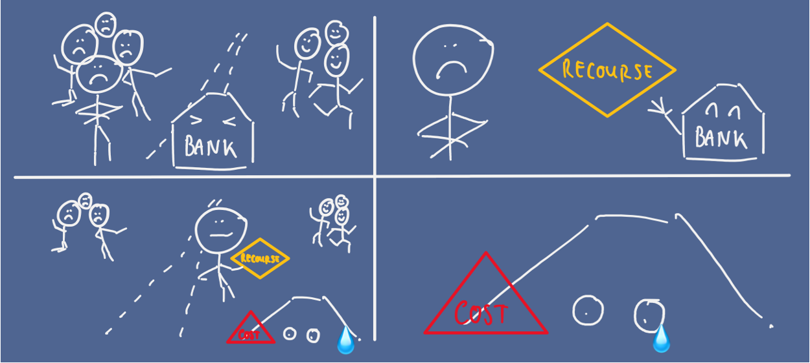
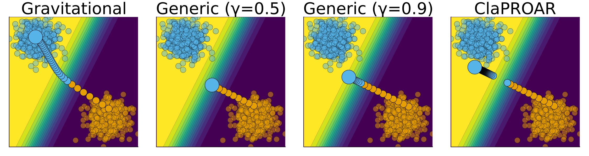
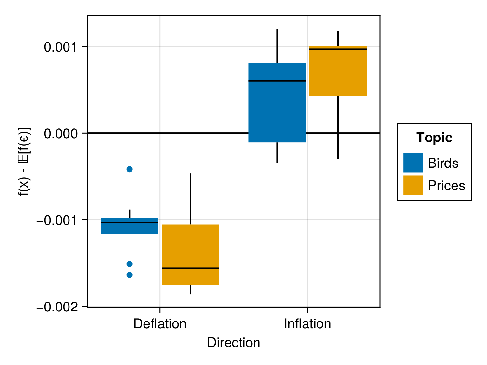

## Background 

::::{.columns}::::
:::{.column width='65%'}

::: {.fragment .fade-in}
 Economist, then PhD CS
:::

::: {.fragment .fade-in}
 How can we make opaque AI more trustworthy?
:::

::: {.fragment .fade-in}
 Explainable AI, Adversarial ML, Probabilistic ML
:::

::: {.fragment .fade-in}
 Core developer and maintainer of [Taija](https://github.com/JuliaTrustworthyAI) (Trustworthy AI in Julia)
:::

:::
:::{.column width='35%'}
.](/www/images/qr.png){width="100%" fig-align="center"}
:::
::::

## Agenda 

::: {.incremental}

- **Intro**: counterfactual explanations (CE) and algorithmic recourse (AR) 
- **Unexpected Challenges**: endogenous dynamics of AR
- **Paradigm Shift**: explanations should be faithful first, plausible second
- **New Opportunities**: teaching models plausible explanations through CE
:::

# Intro

## Training Opaque Models {auto-animate=true}

[*Tweaking Parameters*]{style="color: orange;"}

::: {.columns}
::: {.column width=75%}
**Objective**:

$$
\begin{aligned}
\min_{\textcolor{orange}{\theta}} \{  {\text{yloss}(M_{\theta}(\mathbf{x}),\mathbf{y})} \}
\end{aligned} 
$$ 
:::
::: {.column width=25%}

:::
:::

## Training Opaque Models {auto-animate=true}

[*Tweaking Parameters*]{style="color: orange;"}

::: {.columns}
::: {.column width=75%}
**Objective**:

$$
\begin{aligned}
\min_{\textcolor{orange}{\theta}} \{  {\text{yloss}(M_{\theta}(\mathbf{x}),\mathbf{y})} \}
\end{aligned} 
$$ 

**Solution**:

$$
\begin{aligned}
\theta_{t+1} &= \theta_t - \nabla_{\textcolor{orange}{\theta}} \{  {\text{yloss}(M_{\theta}(\mathbf{x}),\mathbf{y})} \} \\
\textcolor{orange}{\theta^*}&=\theta_T
\end{aligned} 
$$
:::
::: {.column width=25%}

::: {.content-visible when-format="html"}
{width="100%"}
:::

::: {.content-visible when-format="pdf"}
{width="100%"}
:::

:::
:::

## Explaining Opaque Models {auto-animate=true}

[*Tweaking Inputs*]{style="color: purple;"}

::: {.columns}
::: {.column width=75%}

**Objective**:

$$
\begin{aligned}
\min_{\textcolor{purple}{\mathbf{x}}} \{  {\text{yloss}(M_{\textcolor{orange}{\theta^*}}(\mathbf{x}),\mathbf{y^{\textcolor{purple}{+}} }) + \lambda \text{reg}(\mathbf{x};\cdot) } \}
\end{aligned} 
$$ 
:::
::: {.column width=25%}
{width="100%"}
:::
:::

## Explaining Opaque Models {auto-animate=true}

[*Tweaking Inputs*]{style="color: purple;"}

::: {.columns}
::: {.column width=75%}

**Objective**:

$$
\begin{aligned}
\min_{\textcolor{purple}{\mathbf{x}}} \{  {\text{yloss}(M_{\textcolor{orange}{\theta^*}}(\mathbf{x}),\mathbf{y^{\textcolor{purple}{+}} }) + \lambda \text{reg}(\mathbf{x};\cdot)} \}
\end{aligned} 
$$

**Solution**:

$$
\begin{aligned}
\mathbf{x}_{t+1} &= \mathbf{x}_t - \nabla_{\textcolor{purple}{\mathbf{x}}} \{  \text{yloss}(M_{\textcolor{orange}{\theta^*}}(\mathbf{x}),\mathbf{y^{\textcolor{purple}{+}} }) \\&+ \lambda \text{reg}(\mathbf{x};\cdot) \} \\
\textcolor{purple}{\mathbf{x}^*}&=\mathbf{x}_T
\end{aligned} 
$$
:::
::: {.column width=25%}

::: {.content-visible when-format="html"}
{width="100%"}
:::

::: {.content-visible when-format="pdf"}
{width="100%"}
:::
:::
:::

## Algorithmic Recourse

::: {.columns}
::: {.column width="50%"}

Provided CE is valid, plausible and actionable, it can be used to provide recourse to individuals negatively affected by models.

> "If your income had been `x`, then ..."

:::
::: {.column width="50%"}

![Counterfactuals for random samples from the Give Me Some Credit dataset [@kaggle2011give]. Features 'age' and 'income' are shown.](www/credit.png){#fig-credit width=80%}

:::
:::

# Unexpected Challenges

## Hidden Cost of Implausibility

::::{.columns}::::
:::{.column width='50%'}
AR can introduce costly dynamics^[ @altmeyer2023endogenous \@ SaTML 2023.]

{width="100%"}
:::
:::{.column width='50%'}
{#fig-bank-cartoon width="100%"}
:::
::::

 **Insight**: Implausible Explanations Are Costly

## Mitigation Strategies

**Reframed Objective**

$$
\begin{aligned}
\mathbf{s}^\prime &= \arg \min_{\mathbf{s}^\prime \in \mathcal{S}} \{ {\text{yloss}(M(f(\mathbf{s}^\prime)),y^*)} \\ &+ \lambda_1 {\text{cost}(f(\mathbf{s}^\prime))} + \lambda_2 {\text{extcost}(f(\mathbf{s}^\prime))} \}  
\end{aligned} 
$$

::: {.columns}
::: {.column width=50%}
- Even simple mitigation strategies can help.
- Reducing hidden cost is (roughly) equivalent to ensuring plausibility.
:::
::: {.column width=50%}

:::
:::

# Explanation or Adversarial Example?

## Plausibility at all cost?

All of these counterfactuals are valid explanations for the model's prediction. 

> Pick your poison ...

![Turning a 9 into a 7: Counterfactual explanations for an image classifier using different approaches [@altmeyer2024faithful].](/www/images/mnist_motivation.png){#fig-cf-example width="75%"}

## Faithful First, Plausible Second

::::{.columns}::::
:::{.column width='30%'}
{#fig-mnist-eccco width="75%"}
:::
:::{.column width='70%'}
 **Insight**: faithfulness facilitates^[ @altmeyer2024faithful \@ AAAI 2024. [[blog]](/blog/posts/eccco/index.qmd)]

- model quality checks (@fig-mnist-eccco).
- state-of-the-art plausibility (@fig-mnist-benchmark).

{#fig-mnist-benchmark width="100%"}
:::
::::

# Putting it all together

## Counterfactual Training {auto-animate=true}

First, [*Tweaking Inputs*]{style="color: purple;"}^[Generate faithful explanations using *ECCCo* objective [@altmeyer2024faithful].]

$$
\begin{aligned}
\mathbf{x}_{t+1} &= \mathbf{x}_t - \nabla_{\textcolor{purple}{\mathbf{x}}} \{  {ECCCo(M_{\textcolor{orange}{\theta^*}}(\mathbf{x}),\mathbf{y^{\textcolor{purple}{+}} })} \} \\
\textcolor{purple}{\mathbf{x}^*}&=\mathbf{x}_T
\end{aligned} 
$$

Then, [*Tweaking Parameters*]{style="color: orange;"}

$$
\begin{aligned}
\theta_{t+1} &= \theta_t - \nabla_{\textcolor{orange}{\theta}} \{  {\text{yloss}(M_{\theta}(\mathbf{x}),\mathbf{y})} + \text{div}(\textcolor{purple}{\mathbf{x}^*},\mathbf{x}^+,y^+; \theta) \} \\
\textcolor{orange}{\theta^*}&=\theta_T
\end{aligned} 
$$

## Counterfactual Training {auto-animate=true}

:::{.incremental}
1. Contrast faithful CE with data $\rightarrow$ **Explainability** $\uparrow$
2. Feature mutability constraints $\rightarrow$ **Actionability** $\uparrow$[(holds provably under certain assumptions)]{style="font-size: 0.8em;"}
3. Bonus: use nascent CE as AE $\rightarrow$ **Robustness** $\uparrow$
:::

. . .

{#fig-ecml width="90%"}

## Counterfactual Training: Results

::: {.columns}
::: {.column width=50%}
{width=70%} 
:::
::: {.column width=50%}
{width="60%"}
:::
:::

{width=70%}

## The Hard Numbers

Extensive experiments and ablation studies on nine datasets--synthetic, tabular and vision--generating millions of counterfactuals:^[Facilitated by our [CounterfactualExplanations.jl](https://github.com/JuliaTrustworthyAI/CounterfactualExplanations.jl) [@altmeyer2023explaining] with multi-processing support and @DHPC2022.]

1. **Plausibility** of CEs increases by up to 90%.
2. **Actionability**: cost of reaching valid counterfactuals with protected features decreases by 19% on average.
3. Models’ adversarial **robustness** improves consistently.

## Check it out!

::: {layout-ncol=3}

:::

## Taija {.smaller}

::::{.columns}::::
:::{.column width='50%'}
- Model Explainability ([CounterfactualExplanations.jl](https://github.com/JuliaTrustworthyAI/CounterfactualExplanations.jl))
- Predictive Uncertainty Quantification ([ConformalPrediction.jl](https://github.com/JuliaTrustworthyAI/ConformalPrediction.jl))
- Effortless Bayesian Deep Learning ([LaplaceRedux.jl](https://github.com/JuliaTrustworthyAI/LaplaceRedux.jl))
- ... and more!
:::
:::{.column width='50%'}
- Work presented \@ JuliaCon 2022, 2023, 2024.
- Google Summer of Code and Julia Season of Contributions 2024.
- Total of three software projects \@ TU Delft.
:::
::::

[{width="50%" fig-align="center"}](https://github.com/JuliaTrustworthyAI)

# If we still have time ...

## Spurious Sparks of AGI

::::{.columns}::::
:::{.column width='50%'}
We challenge the idea that the finding of meaningful patterns in latent spaces of large models is indicative of AGI^[ In @altmeyer2024position \@ ICML 2024].
:::
:::{.column width='50%'}
{#fig-attack-inflation width="100%"}
:::
::::

## References {.scrollable .smaller}

