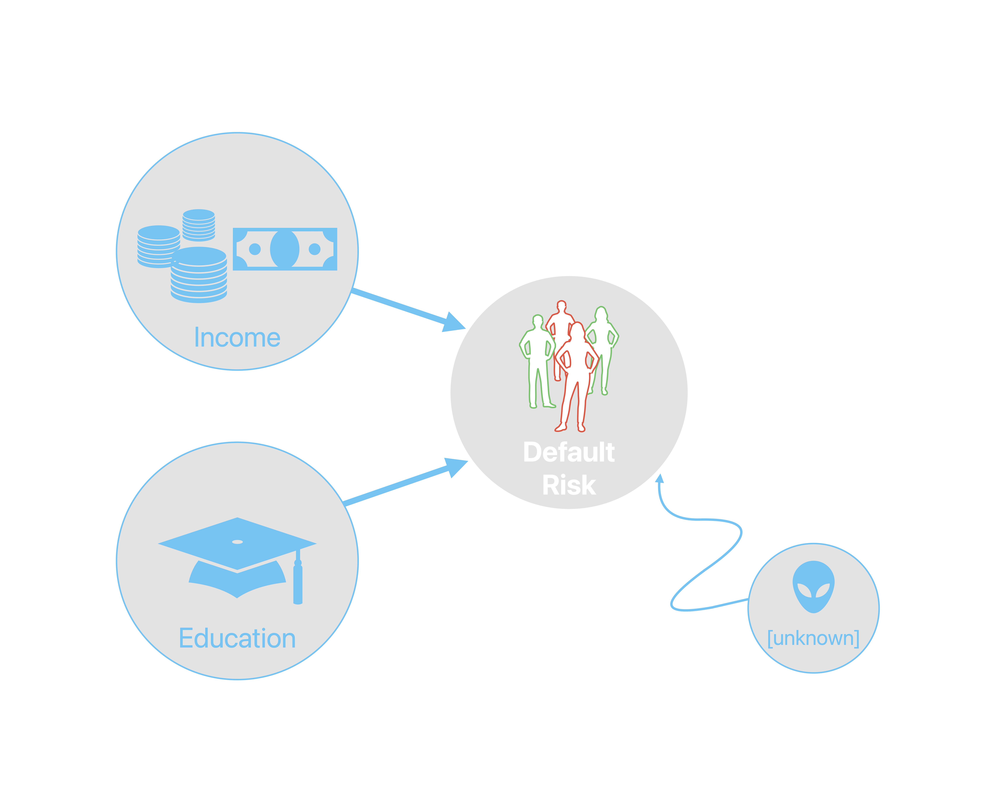
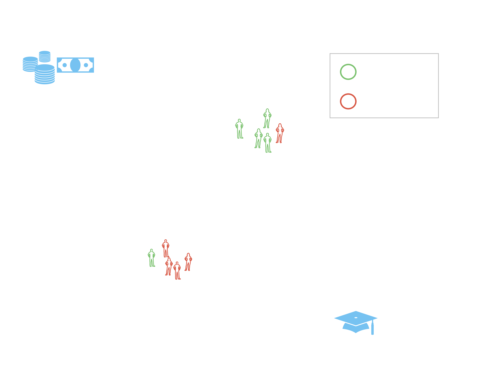
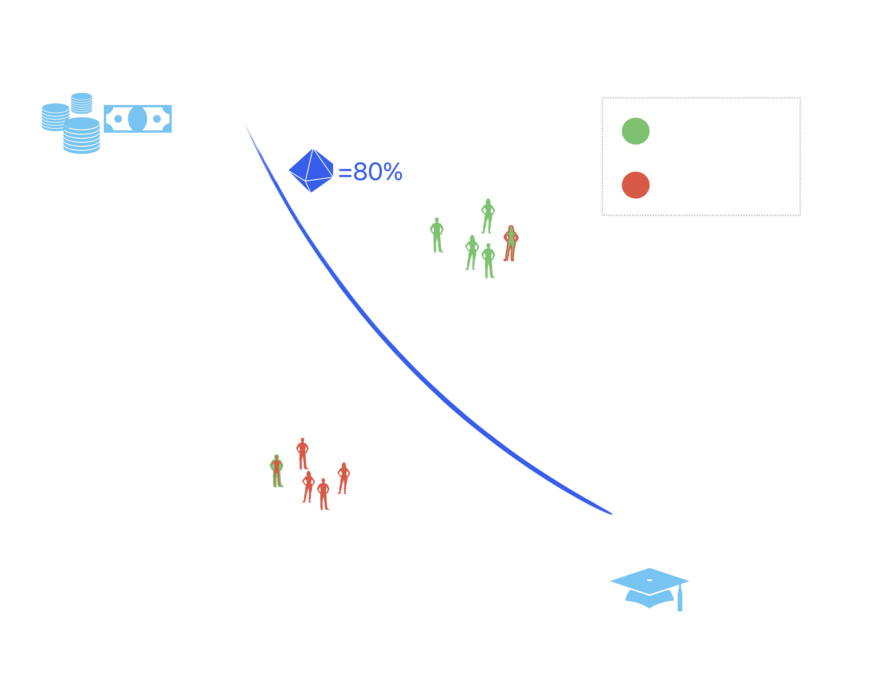

## The Ground Truth (Reality) {auto-animate=true}

{#fig-pred width="60%"}

## The Ground Truth (Reality) {auto-animate=true} 

{#fig-gt width="60%"}

## Black-Box AI {auto-animate=true}

{#fig-clf width="60%"}

## Black-Box AI {auto-animate=true}

](www/presentation/s4.png){#fig-ce width="60%"}

## Black-Box AI {auto-animate=true}

](www/presentation/s5.png){#fig-ar width="60%"}

## Black-Box AI {auto-animate=true}

](www/presentation/s6.png){#fig-plausible-ce width="60%"}

## Black-Box AI {auto-animate=true}

](www/presentation/s7.png){#fig-plausible-ar width="60%"}

## Big, Beautiful Black-Box AI {auto-animate=true}

](www/presentation/s8.png){#fig-big-clf width="60%"}

## Big, Beautiful Black-Box AI {auto-animate=true}

](www/presentation/s9.png){#fig-big-plausible-ce width="60%"}

## Big, Beautiful Black-Box AI {auto-animate=true}

](www/presentation/s10.png){#fig-worst-case width="60%"}

## Holding Models Accountable {auto-animate=true}

](www/presentation/s11.png){#fig-best-case width="60%"}

## 'ok but agi bruh'

](www/presentation/s12.jpg){#fig-agi}

## In all seriousness ... {auto-animate=true}

:::{.incremental}
- Useful? Absolutely
- AGI? Sentient? Conscious? No: 'emergence' in complex systems does not hint at any of this
:::

## In all seriousness ... {auto-animate=true}

:::{.incremental}
- Emergence broadly described as broad behaviour of complex systems that's different from its constituent parts:
  - Example 1: asset price bubbles in financial markets -> locally predictable, rational behaviour, but also market failure
  - Example 2: tornado -> just dust and debris, but also a possible disaster
- Does it matter?
:::

